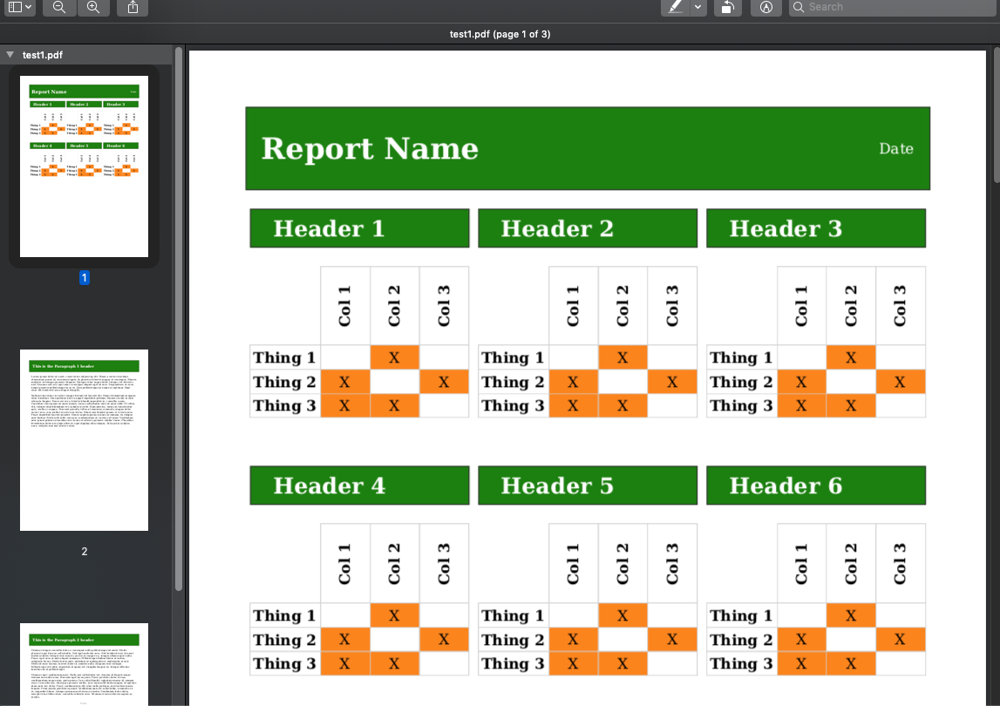

# weasyprint test

A simple, Docker-ized (def not required) snippet of code to test performance and CSS support for [weasyprint's](https://weasyprint.org/) HTML to PDF conversion.



## PERFORMANCE

Using [this simple template](templates/test.html) with [this CSS](templates/test.css), on my 2015 MacBook Pro I generated **100 PDFs in ~24 seconds**!

I did note that the performance decreased dramatically from my first, _very_ simple test to the HTML & CSS I have now.. so I recommend testing with a realistic sample.

## CSS SUPPORT

I proved to myself that print margins and page breaks, as well as more "advanced" CSS like **flexbox** layout and **transform: rotate()** are supported by weasyprint.

Unfortunately, `writing-mode: vertical-lr` wasn't supported yet, but weasyprint graciously _let me know!_
```
weasyprint - WARNING - Ignored `writing-mode: vertical-lr` at 29:3, unknown property.
```

## CONCLUSION

Since HTML & CSS is squarely in the skillset of (dare I say) most developers, and allows us to
render both in the browser and as a PDF document (reuse, baby!) reasonably quickly, I see weasyprint
in my teams' futures =)

## Try it yourself

If you have Docker installed, clone this repo, run `docker-compose up` and check your `templates\output` directory.
